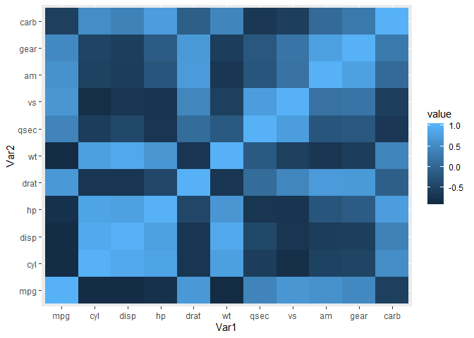
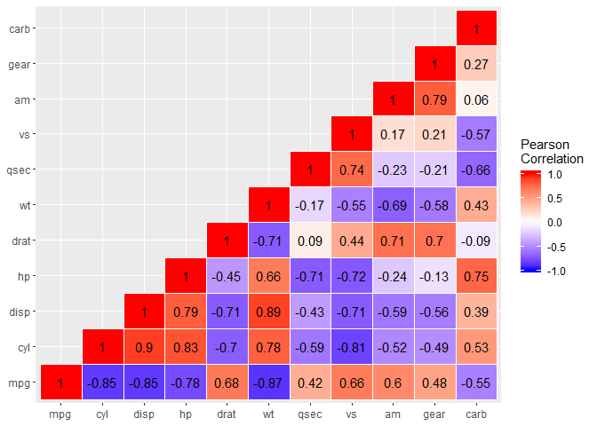

Visual Analytics Module 8 - Correlation Analysis
================

For this visual correlation analysis, I will be using the 'mtcars' dataset provided in R. We begin by first creating a correlation matrix of the dataset to give an idea of what our correlation visualizations should look like. After that we melt the data in order to visualize each of the data columns/rows, make it simpler and to help remove redundancy for later. For example, we only need the correlation of MPG to CYL, and not CYL to MPG as well, and then we begin constructing our correlation visualizations.

``` r
mtcars_cor = round(cor(mtcars),2)
head(mtcars_cor)
```

    ##        mpg   cyl  disp    hp  drat    wt  qsec    vs    am  gear  carb
    ## mpg   1.00 -0.85 -0.85 -0.78  0.68 -0.87  0.42  0.66  0.60  0.48 -0.55
    ## cyl  -0.85  1.00  0.90  0.83 -0.70  0.78 -0.59 -0.81 -0.52 -0.49  0.53
    ## disp -0.85  0.90  1.00  0.79 -0.71  0.89 -0.43 -0.71 -0.59 -0.56  0.39
    ## hp   -0.78  0.83  0.79  1.00 -0.45  0.66 -0.71 -0.72 -0.24 -0.13  0.75
    ## drat  0.68 -0.70 -0.71 -0.45  1.00 -0.71  0.09  0.44  0.71  0.70 -0.09
    ## wt   -0.87  0.78  0.89  0.66 -0.71  1.00 -0.17 -0.55 -0.69 -0.58  0.43

``` r
melted_mtcars = melt(mtcars_cor)
head(melted_mtcars)
```

    ##   Var1 Var2 value
    ## 1  mpg  mpg  1.00
    ## 2  cyl  mpg -0.85
    ## 3 disp  mpg -0.85
    ## 4   hp  mpg -0.78
    ## 5 drat  mpg  0.68
    ## 6   wt  mpg -0.87

``` r
p1 = ggplot(data = melted_mtcars, aes(x=Var1, y=Var2, fill=value)) + 
  geom_tile()

p1
```



The first graph here shows a simple visualization of a correlation matrix, with the most significant correlation (1.0) being a light blue, no correlation (0.0) being regular/dark blue, and a negative correlation (-1.0) being black. While this graph does a good job at quickly displaying correlation, it is not exactly nice to look at and it still has redundancy which would make it look better if disappeared.

I used the function below to cut half of the data off the correlation matrix and list it as "NA".

``` r
cuthalf = function(cuthalf){
    cuthalf[upper.tri(cuthalf)]<- NA
    return(cuthalf)
}

halfmtcars = cuthalf(mtcars_cor)
halfmtcars
```

    ##        mpg   cyl  disp    hp  drat    wt  qsec    vs   am gear carb
    ## mpg   1.00    NA    NA    NA    NA    NA    NA    NA   NA   NA   NA
    ## cyl  -0.85  1.00    NA    NA    NA    NA    NA    NA   NA   NA   NA
    ## disp -0.85  0.90  1.00    NA    NA    NA    NA    NA   NA   NA   NA
    ## hp   -0.78  0.83  0.79  1.00    NA    NA    NA    NA   NA   NA   NA
    ## drat  0.68 -0.70 -0.71 -0.45  1.00    NA    NA    NA   NA   NA   NA
    ## wt   -0.87  0.78  0.89  0.66 -0.71  1.00    NA    NA   NA   NA   NA
    ## qsec  0.42 -0.59 -0.43 -0.71  0.09 -0.17  1.00    NA   NA   NA   NA
    ## vs    0.66 -0.81 -0.71 -0.72  0.44 -0.55  0.74  1.00   NA   NA   NA
    ## am    0.60 -0.52 -0.59 -0.24  0.71 -0.69 -0.23  0.17 1.00   NA   NA
    ## gear  0.48 -0.49 -0.56 -0.13  0.70 -0.58 -0.21  0.21 0.79 1.00   NA
    ## carb -0.55  0.53  0.39  0.75 -0.09  0.43 -0.66 -0.57 0.06 0.27    1

After again melting the graph, if we were to now construct the same graph, it would look much neater and simpler.

``` r
melted_mtcars = melt(halfmtcars,na.rm=TRUE)

p2 = ggplot(data = melted_mtcars, aes(x=Var1, y=Var2, fill=value)) + 
  geom_tile()
p2
```


Now that the graph is simplified and redundancy is gone, we can clean it up and make it look neater/more visually appealing.

``` r
p3 = ggplot(data = melted_mtcars, aes(x=Var1, y=Var2, fill=value)) + 
geom_tile(color="white")+scale_fill_gradient2(low = "blue", high = "red", mid = "white", 
midpoint = 0, limit = c(-1,1), space = "Lab", 
name="Pearson\nCorrelation") + theme(axis.title.x = element_blank(),axis.title.y = element_blank())+ geom_text(aes(Var1, Var2, label = value), color = "black", size = 4)
p3
```



We now have a clear, descriptive and visually appealing correlation graph that is easy to look at and understand.
